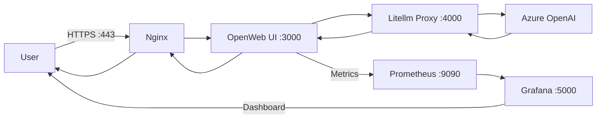

# AzurOpenAi Deployment Test

This repository serves as a template for deploying models in Azure OpenAI and integrating them with OpenWeb UI using the Litellm Proxy. The project establishes a robust infrastructure leveraging Docker Compose for container orchestration and includes monitoring tools for performance metrics.

## Features

- **OpenWeb UI**: User-friendly interface for interacting with models.
- **Litellm Proxy**: Configurable proxy for seamless communication with Azure OpenAI.
- **Grafana & Prometheus**: Monitoring and visualization tools for system performance.
- **Nginx**: Secure reverse proxy supporting HTTPS.
- **Automated Admin Setup**: Database population with initial admin users and groups via Python script.

---

## Table of Contents

- [Prerequisites](#prerequisites)
- [Setup Instructions](#setup-instructions)
- [Services and Ports](#services-and-ports)
- [Monitoring](#monitoring)
- [Flowchart](#flowchart)
- [Contributing](#contributing)
- [License](#license)

---

## Prerequisites

- **Docker**: Ensure Docker is installed and running on your system.
- **Docker Compose**: Verify Docker Compose is installed.
- **Python**: Required for executing setup scripts.

---

## Setup Instructions

1. **Clone the Repository**:

   ```bash
   git clone https://github.com/Raxel01/AzurOpenAi-Deployment-Test.git
   ```

2. **Navigate to the Project Directory**:

   ```bash
   cd AzurOpenAi-Deployment-Test/LitellmOpenAi
   ```

3. **Configure Litellm Proxy**:

   Update the `Litellm_setup/config.yaml` file with your Azure OpenAI credentials and deployment details.

4. **Automate Admin and Group Creation**:

   Execute the `populate_db.py` script to set up the database with default admin users and groups:

   ```bash
   python populate_db.py
   ```

5. **Start the Services**:

   Use Makefile to start the project:

   - `make` or `make up`: Start the project.
   - `make stop`: Stop the containers.
   - `make start`: Restart the stopped containers.
   - `make down`: Stop and remove all services.
   - `make re`: Clean the environment and restart the services.
   - `make clean`: Forcefully remove all Docker artifacts.
   - `make prune`: Perform a complete system cleanup.

6. **Access the Application**:

   - OpenWeb UI: `https://<your-domain>` everything 0.0.0.0 1.1.1.1
   - Grafana Dashboard: `http://<your-domain>:5000`

---

## Services and Ports

The project utilizes the following services, orchestrated via Docker Compose:

| Service          | Port | Description                         |
|------------------|------|-------------------------------------|
| openwebui        | N/A  | Handled by Nginx for model interaction |
| LitellmOpenAi    | 4000 | Litellm Proxy for Azure OpenAI     |
| grafana          | 5000 | Monitoring dashboard               |
| prometheus       | 9090 | Metrics collection                 |
| nginx            | 443  | HTTPS reverse proxy                |

---

## Monitoring

- **Prometheus**: Collects system and application metrics.
- **Grafana**: Visualizes metrics via customizable dashboards.

Access the Grafana dashboard at `http://<your-domain>:5000` using the default admin credentials provided in the setup.

---

## Flowchart

The following flowchart illustrates the system architecture:



---

## Contributing

Contributions are welcome! To contribute:

1. Fork the repository.
2. Create a feature branch.
3. Submit a pull request for review.

---

## License

This project is licensed under the MIT License. See the [LICENSE](LICENSE) file for details.
